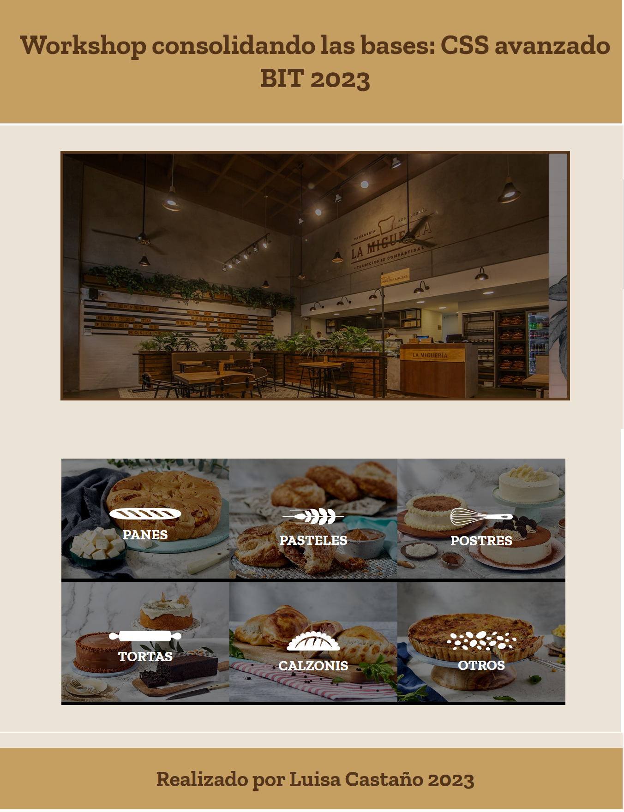

# Workshop 1: Consolidando las bases en CSS
## CSS Avanzado

## Descripción
Este repositorio contiene el contenido del Workshop 1. En este taller, exploraremos diversos temas relacionados con CSS avanzado, tomando como base la página de La Miguería.

A continuación, se presentan los temas principales de este proyecto:

1. Annimaciones con CSS.
2. Transiciones con CSS.
3. Flexbox y Grid.
3. "Position absolute" y "position relative".

## Actividades
|  |
|:----------------------------------------:|
|              Proyecto CSS avanzado              |

## Autor
- Luisa Fernanda Castaño Vanegas

## Copyright
Material creado por [Luisa Castaño](https://github.com/LuisaCastano40) 

Workshop organizado por BIT: Bogotá Institute of Technology. 

¡Gracias por participar en nuestro workshop!
