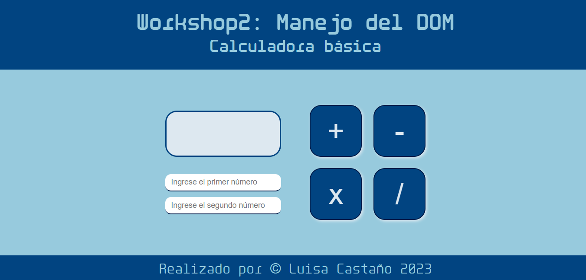
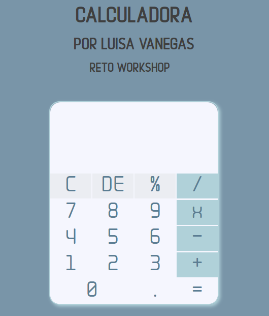

# Workshop 2: Consolidando las bases en Js
## Manejo del DOM y Lógica de programación

## Descripción
Este repositorio contiene el contenido del Workshop 2. En este taller, exploraremos diversos temas relacionados con las bases de js, tomando los conocimientos teóricos y aplicándolos para la realización de una calculadora básica.

A continuación, se presentan los temas principales de este proyecto:

1. Manejo del DOM.
2. Evento onclick.
3. Condicionales y funciones en js.
3. Reto calculadora básica funcional.

## Actividades
|  |  |
|:----------------------------------------:|:------------------------------------------:|
|              Calculadora Básica               |              Reto Workshop 2           |

## Autor
- Luisa Fernanda Castaño Vanegas

## Copyright
Material creado por [Luisa Castaño](https://github.com/LuisaCastano40) 

Workshop organizado por BIT: Bogotá Institute of Technology. 

¡Gracias por participar en nuestro workshop!
