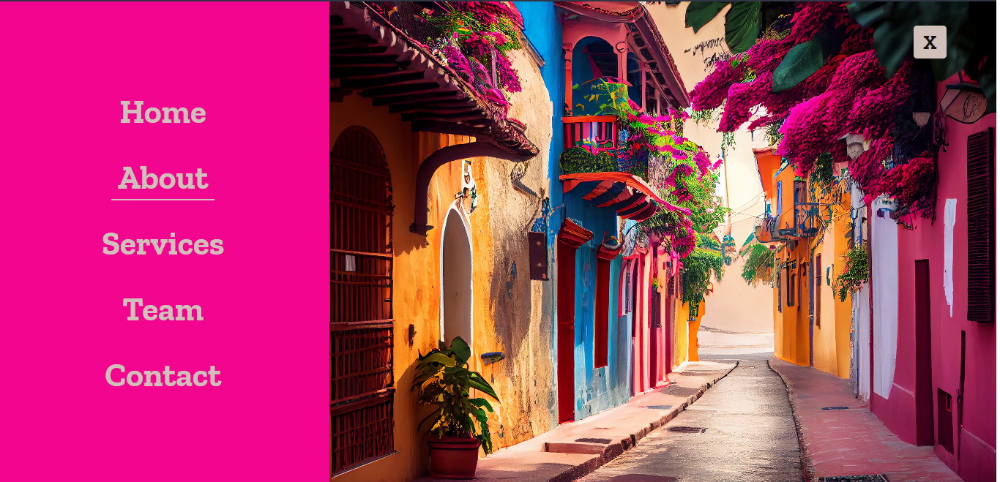

# Workshop 4: Consolidando las bases en Js
## Manejo de eventos con JavaScript

## Descripción
Este repositorio contiene el contenido del Workshop 4. En este taller, exploraremos diversos temas relacionados con las bases de js, implementando el manejo de eventos para la realización de un baner interactivo.

A continuación, se presentan los temas principales de este proyecto:

1. Manejo del DOM.
2. Manejo de Eventos.
3. Uso de funciones declaradas y anónimas
4. Lógica de programación

## Actividades
|  |  | | |
|:----------------------------------------:|:------------------------------------------:|
|              Proyecto workshop 4              |              Banner interactivo vista home           |        interactivo vista About           |     interactivo vista contact           |

## Autor
- Luisa Fernanda Castaño Vanegas

## Copyright
Material creado por [Luisa Castaño](https://github.com/LuisaCastano40) 

Workshop organizado por BIT: Bogotá Institute of Technology. 

Imagenes tomades de [Freepik](https://www.freepik.es/) 

¡Gracias por participar en nuestro workshop!
